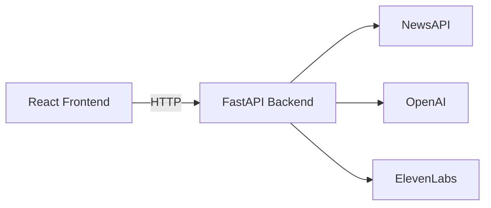

# NewsReal

## Getting Started

1. Clone the repository.
2. Install dependencies:
   ```sh
   npm install
   ```
3. Copy `.env.example` to `.env` and fill in the required API keys.
4. Start the frontend development server:
   ```sh
   npm run dev
   ```
5. In a separate shell, install and start the FastAPI backend:
   ```sh
   pip install -r requirements.txt
   uvicorn backend.main:app --reload
   ```

### Backend environment variables

The backend relies on several API keys. Set them in your shell or a `.env` file before starting the server:

```bash
NEWS_API_KEY=<your NewsAPI key>
OPENAI_API_KEY=<your OpenAI key>
ELEVENLABS_API_KEY=<your ElevenLabs key>
```

## Technologies

- Vite
- TypeScript
- React
- shadcn-ui
- Tailwind CSS

## Architecture
The React frontend communicates with a FastAPI backend, which then calls external services.



## Deployment

Build the project for production with:
```sh
npm run build
```
The output in `dist/` can be hosted on any static file server.
